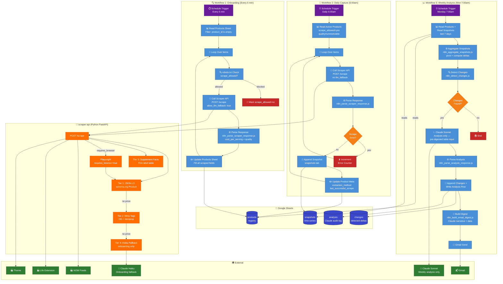

# Vitamin Price Monitor — Architecture Diagram

```mermaid
flowchart TD
    subgraph Onboarding["🔍 Workflow 1: Onboarding (Every 5 min)"]
        A1["⏱️ Schedule Trigger\nEvery 5 min"]
        A2["📊 Read Products Sheet\nFilter: product_id is empty"]
        A3["🔁 Loop Over Items"]
        A4["🔍 robots.txt Check\nscrape_allowed?"]
        A5["📡 Call Scraper API\nPOST /scrape\nallow_llm_fallback: true"]
        A6["⚙️ Parse Response\nn8n_parse_scraper_response.js\ncost_per_serving + quality"]
        A7["✏️ Update Products Sheet\nFill all scraped fields"]

        A1 --> A2 --> A3 --> A4
        A4 -->|"blocked"| AX["🚫 Mark scrape_allowed=no"]
        A4 -->|"allowed"| A5
        A5 --> A6 --> A7 --> A3
    end

    subgraph Daily["📅 Workflow 2: Daily Capture (6:00am)"]
        B1["⏰ Schedule Trigger\nDaily 6:00am"]
        B2["📊 Read Active Products\nscrape_allowed=yes\nquality≠unresolvable"]
        B3["🔁 Loop Over Items"]
        B4["📡 Call Scraper API\nPOST /scrape\nno llm_fallback"]
        B5["⚙️ Parse Response\nn8n_parse_scraper_response.js"]
        B6{"Scrape\nError?"}
        B7["⬆️ Increment\nError Counter"]
        B8["📝 Append Snapshot\nsnapshots tab"]
        B9["✏️ Update Product Meta\nextraction_method\nlast_successful_scrape"]

        B1 --> B2 --> B3 --> B4 --> B5 --> B6
        B6 -->|"yes"| B7 --> B3
        B6 -->|"no"| B8 --> B9 --> B3
    end

    subgraph Weekly["📈 Workflow 3: Weekly Analysis (Mon 7:00am)"]
        W1["⏰ Schedule Trigger\nMonday 7:00am"]
        W2["📊 Read Products +\nRead Snapshots\nlast 7 days"]
        W3["⚙️ Aggregate Snapshots\nn8n_aggregate_snapshots.js\npivot + compute deltas"]
        W4["🔍 Detect Changes\nn8n_detect_changes.js"]
        W5{"Changes\nFound?"}
        W6["✨ Claude Sonnet\nAnalysis only —\npre-digested table input"]
        W7["⚙️ Parse Analysis\nn8n_parse_analysis_response.js"]
        W8["📝 Append Changes +\nWrite Analysis Row"]
        W9["📧 Build Digest\nn8n_build_email_digest.js\nClaude narrative + data"]
        W10["📨 Gmail Send"]

        W1 --> W2 --> W3 --> W4 --> W5
        W5 -->|"no"| W_END["🔇 End"]
        W5 -->|"yes"| W6 --> W7 --> W8 --> W9 --> W10
    end

    subgraph ScraperAPI["🐍 scraper-api (Python FastAPI)"]
        S1["POST /scrape"]
        S2["Tier 1: JSON-LD\nschema.org Product"]
        S3["Tier 2: Meta Tags\nOG + itemprop"]
        S4["Tier 3: Supplement Facts\nFDA label table"]
        S5["Tier 4: Haiku Fallback\nonboarding only"]
        S6["Playwright\nrequires_browser=true"]

        S1 --> S2
        S2 -->|"no price"| S3
        S3 -->|"no price"| S5
        S1 --> S4
        S1 -->|"requires_browser"| S6 --> S2
    end

    subgraph Storage["💾 Google Sheets"]
        GS1[("products\nregistry")]
        GS2[("snapshots\ntime-series")]
        GS3[("changes\ndetected deltas")]
        GS4[("analysis\nClaude audit log")]
    end

    subgraph External["🌍 External"]
        C1["🏭 NOW Foods"]
        C2["🏭 Life Extension"]
        C3["🏭 Thorne"]
        CL["🤖 Claude Sonnet\nWeekly analysis only"]
        CH["🤖 Claude Haiku\nOnboarding fallback"]
        GM["📬 Gmail"]
    end

    A5 --> S1
    B4 --> S1
    S1 --> C1 & C2 & C3
    S5 --> CH
    A7 --> GS1
    B8 --> GS2
    B9 --> GS1
    W2 -->|"reads"| GS1
    W2 -->|"reads"| GS2
    W8 --> GS3
    W8 --> GS4
    W6 --> CL
    W10 --> GM

    classDef trigger fill:#6A1B9A,stroke:#4A148C,color:white
    classDef workflow fill:#4A90D9,stroke:#2C5F8A,color:white
    classDef scraper fill:#FF6D00,stroke:#E65100,color:white
    classDef storage fill:#3B48CC,stroke:#1A1A2E,color:white
    classDef external fill:#2E7D32,stroke:#1B5E20,color:white
    classDef error fill:#C62828,stroke:#7F0000,color:white
    classDef decision fill:#F57F17,stroke:#E65100,color:white

    class A1,B1,W1 trigger
    class A2,A3,A4,A5,A6,A7,B2,B3,B4,B5,B8,B9,W2,W3,W4,W6,W7,W8,W9,W10 workflow
    class S1,S2,S3,S4,S5,S6 scraper
    class GS1,GS2,GS3,GS4 storage
    class C1,C2,C3,CL,CH,GM external
    class AX,B7,W_END error
    class B6,W5 decision
```
