# Vitamin Price Monitor — n8n Workflow Diagrams

```mermaid
flowchart LR

subgraph WF1["⚙️ Workflow 1 — Onboarding (every 5 min)"]
  A1["🕐 Schedule\nTrigger\n(5 min)"]
  A2["📋 Read Products\nSheet\n(filter: blank product_id)"]
  A3{"🔀 IF\nNew Rows?"}
  A4["🔁 Loop\nOver Items\n(batch 1)"]
  A5["🔧 Extract\nDomain\n(url, domain, path)"]
  A6["🌐 Fetch\nrobots.txt\n(HTTP GET)"]
  A7["📜 Parse\nrobots.txt\n(Code node)"]
  A8{"🔀 IF\nScrape\nAllowed?"}
  A9a["🚫 Update Sheet\n(scrape_allowed=no)"]
  A9b["🕷️ Call Scraper\nAPI\n(POST /scrape)"]
  A10["🔢 Parse Scraper\nResponse\n(cost_per_serving)"]
  A11["🆔 Generate\nproduct_id\n(Code node)"]
  A12["✅ Update\nProducts Sheet\n(all fields)"]

  A1 --> A2 --> A3
  A3 -->|"True"| A4 --> A5 --> A6 --> A7 --> A8
  A3 -->|"False"| STOP1(["⏹️ End"])
  A8 -->|"False"| A9a
  A8 -->|"True"| A9b --> A10 --> A11 --> A12 --> A4
end

subgraph WF2["📸 Workflow 2 — Daily Capture (6:00 am)"]
  B1["🕕 Schedule\nTrigger\n(0 6 * * *)"]
  B2["📅 Set\nRun Date"]
  B3["📋 Read Active\nProducts\n(scrape_allowed=yes)"]
  B4["🔁 Loop\nOver Items\n(batch 1)"]
  B5["🕷️ Call Scraper\nAPI\n(llm_fallback=false)"]
  B6["🔢 Parse Scraper\nResponse"]
  B7{"🔀 IF\nError?"}
  B8a["⚠️ Increment\nError Counter\n(Update Sheet)"]
  B8b["📊 Append\nSnapshot Row\n(snapshots tab)"]
  B9["🔄 Update\nProduct Meta\n(errors=0, last_scrape)"]

  B1 --> B2 --> B3 --> B4 --> B5 --> B6 --> B7
  B7 -->|"True"| B8a --> B4
  B7 -->|"False"| B8b --> B9 --> B4
end

subgraph WF3["📈 Workflow 3 — Weekly Analysis (Mon 7:00 am)"]
  W1["🕖 Schedule\nTrigger\n(0 7 * * 1)"]
  W2["📅 Set\nRun Start\n(+ 7 days ago)"]
  W3["📋 Read\nProducts Sheet"]
  W4["📊 Read\nSnapshots\n(last 7 days)"]
  W5["🔢 Aggregate\nSnapshots\n(Code node)"]
  W6["🔍 Detect\nChanges\n(≥ 0.1%)"]
  W7{"🔀 IF Any\nChanges?"}
  W8["✍️ Build\nClaude Prompt\n(inject summary_table)"]
  W9["🤖 Call\nClaude Sonnet\n(HTTP POST)"]
  W10["📋 Parse\nClaude Response\n(Code node)"]
  W11["💾 Append\nChanges Tab"]
  W12["💾 Write\nAnalysis Row"]
  W13["📧 Build\nEmail Digest\n(Code node)"]
  W14{"🔀 IF\nHas Changes?"}
  W15["📬 Gmail\nSend Digest"]

  W1 --> W2 --> W3 & W4 --> W5 --> W6 --> W7
  W7 -->|"False"| STOP2(["⏹️ End"])
  W7 -->|"True"| W8 --> W9 --> W10
  W10 --> W11 & W12
  W12 --> W13 --> W14
  W14 -->|"True"| W15
  W14 -->|"False"| STOP3(["⏹️ End"])
end

classDef trigger fill:#4A90D9,stroke:#2C6FAC,color:#fff
classDef process fill:#5BA85A,stroke:#3D7A3C,color:#fff
classDef decision fill:#F5A623,stroke:#C07D0A,color:#fff
classDef storage fill:#9B59B6,stroke:#6C3483,color:#fff
classDef external fill:#E74C3C,stroke:#A93226,color:#fff
classDef endpoint fill:#95A5A6,stroke:#707B7C,color:#fff

class A1,B1,W1 trigger
class A2,A5,A6,A7,A9b,A10,A11,A12,B2,B5,B6,B8a,B8b,B9,W2,W5,W6,W8,W10,W13 process
class A3,A8,B7,W7,W14 decision
class A9a,W3,W4,W11,W12 storage
class W9,W15 external
class STOP1,STOP2,STOP3 endpoint
```

---

## Node Reference

### Workflow 1 — Onboarding

| Node | Type | Key Output |
|------|------|-----------|
| A1 Schedule Trigger | Schedule | fires every 5 min |
| A2 Read Products Sheet | Google Sheets | rows where `product_id` is blank |
| A3 IF New Rows | IF | branches on `$input.all().length > 0` |
| A4 Loop Over Items | Split In Batches (size 1) | one product per iteration |
| A5 Extract Domain | Set | `url`, `domain`, `vitamin` |
| A6 Fetch robots.txt | HTTP Request | raw robots.txt body |
| A7 Parse robots.txt | Code (`n8n_parse_robots.js`) | `scrape_allowed`, `matched_rule` |
| A8 IF Scrape Allowed | IF | branches on `scrape_allowed !== 'no'` |
| A9a Update Sheet (Blocked) | Google Sheets Update | marks `scrape_allowed=no` |
| A9b Call Scraper API | HTTP Request POST `/scrape` | raw scraper JSON (`allow_llm_fallback: true`) |
| A10 Parse Scraper Response | Code (`n8n_parse_scraper_response.js`) | `cost_per_serving`, `normalization_quality` |
| A11 Generate product_id | Code (inline) | `{competitor_code}-{vitamin_code}-{seq}` |
| A12 Update Products Sheet | Google Sheets Update | all 14 product fields |

### Workflow 2 — Daily Capture

| Node | Type | Key Output |
|------|------|-----------|
| B1 Schedule Trigger | Schedule | cron `0 6 * * *` |
| B2 Set Run Date | Set | `run_date` (ISO date string) |
| B3 Read Active Products | Google Sheets | filter: `scrape_allowed=yes`, `normalization_quality != unresolvable` |
| B4 Loop Over Items | Split In Batches (size 1) | one product per iteration |
| B5 Call Scraper API | HTTP Request POST `/scrape` | `allow_llm_fallback: false` |
| B6 Parse Scraper Response | Code (`n8n_parse_scraper_response.js`) | price metrics + quality flag |
| B7 IF Error | IF | branches on `scraper_error !== null` |
| B8a Increment Error Counter | Google Sheets Update | `consecutive_errors + 1` |
| B8b Append Snapshot | Google Sheets Append | new row in `snapshots` tab |
| B9 Update Product Meta | Google Sheets Update | `consecutive_errors=0`, `last_successful_scrape` |

### Workflow 3 — Weekly Analysis

| Node | Type | Key Output |
|------|------|-----------|
| W1 Schedule Trigger | Schedule | cron `0 7 * * 1` |
| W2 Set Run Start | Set | `run_start`, `seven_days_ago` |
| W3 Read Products Sheet | Google Sheets | all active products |
| W4 Read Snapshots | Google Sheets | rows where `run_date >= seven_days_ago` |
| W5 Aggregate Snapshots | Code (`n8n_aggregate_snapshots.js`) | `products[]` with 7-day history, `summary_table_md` |
| W6 Detect Changes | Code (`n8n_detect_changes.js`) | change records (≥ 0.1% threshold) |
| W7 IF Any Changes | IF | branches on `!no_changes` sentinel |
| W8 Build Claude Prompt | Set | `system_prompt`, `user_prompt` (injected with live data) |
| W9 Call Claude Sonnet | HTTP Request POST Anthropic API | raw Claude JSON response |
| W10 Parse Claude Response | Code (`n8n_parse_analysis_response.js`) | `executive_summary`, `significant_changes[]`, `watch_list[]` |
| W11 Append Changes | Google Sheets Append | rows in `changes` tab |
| W12 Write Analysis Row | Google Sheets Append | row in `analysis` tab |
| W13 Build Email Digest | Code (`n8n_build_email_digest.js`) | `subject`, `body_text`, `body_html` |
| W14 IF Has Changes | IF | branches on `has_changes === true` |
| W15 Gmail Send Digest | Gmail | sends to `VITAMIN_MONITOR_RECIPIENT` |

---

> **Design note:** W3 and W4 run in parallel — connect both from W2. The aggregate script
> reads them by node name (`$('Read Products Sheet')` and `$('Read Snapshots')`).
> Connect both output branches into W5 using a Merge node (Append mode), or configure W5
> to accept the final branch only (the script pulls from named nodes directly).
