# Contract Kickoff Automation — System Architecture

```mermaid
flowchart LR
    subgraph Trigger["🔔 Trigger"]
        PD[/"📄 PandaDoc\nWebhook"/]
    end

    subgraph WorkflowA["⚙️ n8n Workflow A — Contract Ingestion"]
        direction TB
        A1["A1. Webhook Trigger"]
        A2["A2. Validate & Parse"]
        A3["A3. Download PDF"]
        A4["A4. PDF → Text"]
        A5["A5. Claude Extract"]
        A6["A6. Quality Score"]
        A7{{"A7. Quality Check"}}
        A8["A8. Create Project"]
        A9["A9. Create Tasks"]
        A10["A10. Standard Tasks"]
        A11["A11. Claude Draft Email"]
        A12["A12. Send Kickoff Email"]
        A13["A13. Log: contracts tab"]
        A14["A14. Log: tasks tab"]
        A15["⚠️ A15. Operator Alert"]
    end

    subgraph Services["☁️ External Services"]
        Claude["🤖 Claude API\nclaude-sonnet-4-6"]
        Asana["📋 Asana API"]
        Gmail["📧 Gmail"]
        Sheets["📊 Google Sheets\ncontracts · tasks · errors"]
    end

    PD -->|"document_state_changed\nstatus: completed"| A1
    A1 --> A2 --> A3 --> A4 --> A5 --> A6 --> A7
    A7 -->|"complete / partial"| A8 --> A9 --> A10 --> A11 --> A12
    A7 -->|"insufficient"| A15
    A12 --> A13 --> A14
    A15 --> A13

    A5 -.->|"POST /v1/messages\nextraction"| Claude
    A11 -.->|"POST /v1/messages\nemail draft"| Claude
    A8 -.->|"POST /projects"| Asana
    A9 -.->|"POST /tasks (loop)"| Asana
    A10 -.->|"POST /tasks (5x)"| Asana
    A12 -.->|"Send to client"| Gmail
    A15 -.->|"Alert to operator"| Gmail
    A13 -.->|"Append row"| Sheets
    A14 -.->|"Append row (loop)"| Sheets

    classDef trigger fill:#4CAF50,stroke:#2E7D32,color:white
    classDef node fill:#1565C0,stroke:#0D47A1,color:white
    classDef decision fill:#F57C00,stroke:#E65100,color:white
    classDef alert fill:#C62828,stroke:#B71C1C,color:white
    classDef service fill:#6A1B9A,stroke:#4A148C,color:white

    class PD trigger
    class A1,A2,A3,A4,A5,A6,A8,A9,A10,A11,A12,A13,A14 node
    class A7 decision
    class A15 alert
    class Claude,Asana,Gmail,Sheets service
```



## Data Flow Summary

| Stage | Input | Output |
|-------|-------|--------|
| Trigger (A1–A2) | PandaDoc webhook payload | `document_id`, `client_name`, `client_email` |
| Ingestion (A3–A4) | PandaDoc document ID | Plain text extracted from PDF |
| Extraction (A5–A6) | Contract text | Structured JSON: deliverables, dates, quality score |
| Project creation (A8–A10) | Extracted JSON | Asana project + tasks (extracted + standard) |
| Communication (A11–A12) | Project context | Kickoff email sent to client |
| Audit (A13–A14) | All of the above | Rows appended to Google Sheets |
| Failure path (A15) | Error context | Operator alert email |

## Key Design Decisions

- **Two Claude calls** — extraction and email drafting are separate to keep prompts focused and token usage predictable
- **Always-on audit log** — A13/A14 run regardless of success or failure; nothing is lost silently
- **Graceful degradation** — Asana failure falls back to Google Sheets; email failure does not halt; only `insufficient` extraction halts the happy path
- **Standard tasks always fire** — the 5 onboarding baseline tasks (A10) append to every project as a safety net
```
