# Workflow A — Contract Ingestion (Node-by-Node)

Fires on every DocuSign Connect `envelope-completed` event where `status: completed`.

```mermaid
flowchart TD
    A1["🔔 A1. Webhook Trigger\nPOST /contract-signed\nDocuSign Connect endpoint"]
    A2["🔍 A2. Validate & Parse Webhook\nCode node\nParse DocuSign envelope payload · extract document_id, client fields\nHalt silently if status ≠ completed"]
    A3["📥 A3. Download PDF\nHTTP Request GET\nDocuSign REST API · binary response · 30s timeout"]
    A4["🤖 A4. Analyze Document\nAnthropic native node\nclaude-sonnet-4-5 · max_tokens 4096\nReturns structured JSON"]
    A5b["🔧 A5b. Parse Claude Response\nCode node\nStrip markdown fences · JSON.parse\nThrow on parse failure"]
    A6["📊 A6. Assess Extraction Quality\nCode node\nScores complete / partial / insufficient\nGenerates contract_id · resolves dates"]
    A7{{"A7. IF Quality Check\nextraction_quality ≠ insufficient"}}

    A8["📋 A8. Asana — Create Project\nAsana node\nName: client · service_type\nStores asana_project_gid"]
    A9["📝 A9. Asana — Create Tasks from Deliverables\nLoop Over Items\nOne Asana task per extracted deliverable\nStores task GIDs"]
    A10["✅ A10. Asana — Create Standard Onboarding Tasks\nCode + loop\n5 baseline tasks · due dates from start_date_resolved"]
    A11["✉️ A11. Claude — Draft Kickoff Email\nAnthropic native node\nclaude-sonnet-4-5 · max_tokens 800\nWarm, specific, under 200 words"]
    A12["📧 A12. Gmail — Send Kickoff Email\nGmail node\nTo: client · CC: account manager\nSubject: project name + next steps"]

    A13["📊 A13. Google Sheets — Log to contracts tab\nAppend Row\nAlways runs — success and failure\n15 columns per the schema"]
    A14["📊 A14. Google Sheets — Log to tasks tab\nAppend Row loop\nOne row per task created\nextracted + standard tasks"]
    A15["⚠️ A15. Operator Alert\nGmail node\nTo: operator email\nSubject: contract processing failed"]

    ERR_PDF["🛑 PDF Download Failed\nLog pdf_download_failed\nSend operator alert\nHalt"]
    ERR_JSON["🛑 Claude JSON Parse Failed\nLog claude_extraction_failed\nSet insufficient\nRoute to A15"]

    A1 --> A2
    A2 --> A3
    A3 -->|"success"| A4
    A3 -->|"error"| ERR_PDF
    A4 -->|"valid JSON"| A5b
    A4 -->|"parse failed"| ERR_JSON
    A5b --> A6
    A6 --> A7

    A7 -->|"true: complete or partial"| A8
    A7 -->|"false: insufficient"| A15

    A8 --> A9 --> A10 --> A11 --> A12
    A12 --> A13 --> A14
    A15 --> A13

    ERR_JSON --> A15

    classDef trigger fill:#4CAF50,stroke:#2E7D32,color:white
    classDef code fill:#1565C0,stroke:#0D47A1,color:white
    classDef ai fill:#7B1FA2,stroke:#4A148C,color:white
    classDef decision fill:#F57C00,stroke:#E65100,color:white
    classDef alert fill:#C62828,stroke:#B71C1C,color:white
    classDef sheets fill:#2E7D32,stroke:#1B5E20,color:white
    classDef error fill:#880E4F,stroke:#560027,color:white

    class A1 trigger
    class A2,A5b,A6,A10 code
    class A4,A11 ai
    class A3,A8,A9,A12 http
    class A7 decision
    class A15 alert
    class A13,A14 sheets
    class ERR_PDF,ERR_JSON error
```

## Node Reference

| Node | Type | Key Config |
|------|------|------------|
| A1 | Webhook | POST · `/contract-signed` · DocuSign Connect endpoint |
| A2 | Code | Parses DocuSign Connect envelope payload; validates `status: completed` |
| A3 | HTTP Request | DocuSign REST API · binary response · 30s timeout |
| A4 | Anthropic native node | Analyze Document · `claude-sonnet-4-5` · 4096 max_tokens |
| A5b | Code | Strip markdown fences · JSON.parse · throw on failure |
| A6 | Code | Quality scoring · `contract_id` generation · date resolution |
| A7 | IF | `extraction_quality` ≠ `insufficient` |
| A8 | Asana node | Create project · stores `asana_project_gid` |
| A9 | Loop + Asana node | One task per extracted deliverable |
| A10 | Code + loop | 5 fixed onboarding tasks · due dates from start date |
| A11 | Anthropic native node | Message a Model · `claude-sonnet-4-5` · 800 max_tokens |
| A12 | Gmail | To client · CC account manager · signature from env var |
| A13 | Google Sheets | Append to `contracts` tab · always runs |
| A14 | Google Sheets | Append to `tasks` tab · one row per task |
| A15 | Gmail | Operator alert · failure context in body |
