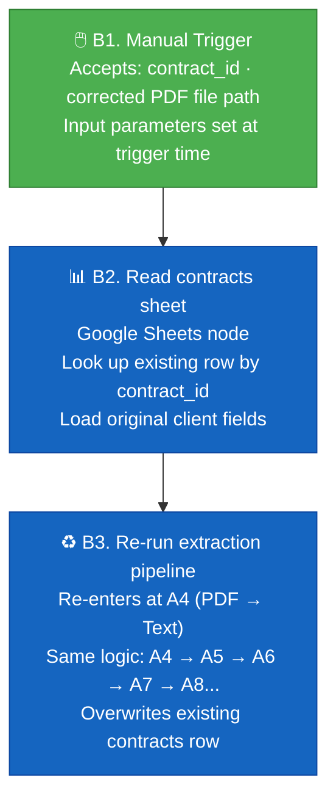

# Workflow B — Manual Reprocess

Manually triggered. Used when a contract was logged as `insufficient` or `failed` and needs to be retried — for example, after the client re-sends a text-based PDF or after correcting an extraction issue.

## When to Use

| Scenario | Action |
|----------|--------|
| Client re-sent a text-based PDF after the original was a scanned image | Reprocess with corrected file path |
| Claude extraction failed due to malformed API response (transient error) | Retry with same contract |
| Contract had insufficient scope; client provided an amended version | Reprocess with new PDF |
| Asana project creation failed (API downtime) but extraction succeeded | Reprocess — Asana will be retried |

## Notes

- The reprocess workflow **overwrites** the existing row in the `contracts` tab — it does not append a new row.
- Task rows in the `tasks` tab are appended fresh — check for duplicate tasks in Asana if the project was partially created on the first run.
- The corrected PDF is read from a local file path on the n8n host — upload the PDF to the server before triggering.
