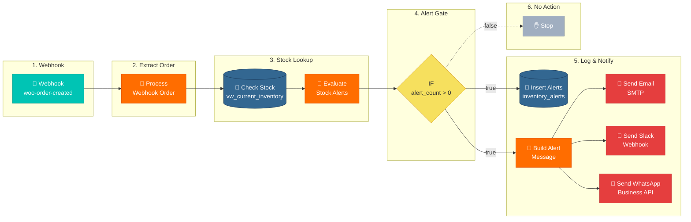

# n8n Workflow 2: Real-Time Inventory Alerts (Webhook-Triggered)

## Node Configuration Reference

| Node | Type | Key Settings |
|------|------|-------------|
| Webhook | Webhook | Method: POST, Path: `woo-order-created` |
| Process Webhook Order | Code (Python) | `scripts/n8n_process_webhook_order.py` |
| Check Stock Levels | PostgreSQL | Query: `scripts/n8n_check_stock_query.sql` |
| Evaluate Stock Alerts | Code (Python) | `scripts/n8n_evaluate_stock_alerts.py` |
| IF: alert_count > 0 | IF | `{{ $json.alert_count }}` greater than `0` |
| Insert Alerts | PostgreSQL | Query: `scripts/n8n_insert_alert.sql` (run once per alert) |
| Build Alert Message | Code (Python) | `scripts/n8n_build_alert_message.py` (reused from Workflow 1) |
| Send Email | Email (SMTP) | Subject: `{{ $json.email_subject }}`, Body: `{{ $json.email_html }}` |
| Send Slack | Slack | Message: `{{ $json.slack_text }}` |
| Send WhatsApp | HTTP Request | POST to WhatsApp Business API, Body: `{{ $json.whatsapp_payload }}` |

## WooCommerce Webhook Setup

1. WooCommerce Admin → Settings → Advanced → Webhooks → Add
2. **Topic:** Order created
3. **Delivery URL:** `https://<n8n-host>/webhook/woo-order-created`
4. **Secret:** (optional, for payload signature verification)
5. **Status:** Active

## Data Flow

1. WooCommerce fires `order.created` → n8n Webhook receives payload
2. Python extracts product IDs + quantities from `line_items`
3. PostgreSQL queries `vw_current_inventory` for those products
4. Python evaluates stock vs reorder point, builds alert list
5. IF `alert_count > 0`:
   - Insert each alert into `inventory_alerts` table
   - Build alert message (reuses `n8n_build_alert_message.py`)
   - Send Email + Slack + WhatsApp notifications
