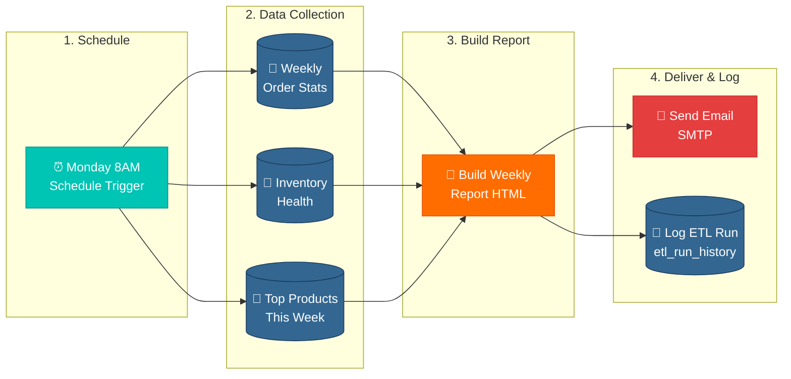

# n8n Workflow 3: Weekly Summary Report (Monday 8AM)

## Node Configuration Reference

| Node | Type | Key Settings |
|------|------|-------------|
| Monday 8AM | Schedule Trigger | Every week, Monday at 8:00 AM |
| Weekly Order Stats | PostgreSQL | Query: `scripts/n8n_weekly_order_stats.sql` |
| Inventory Health | PostgreSQL | Query: `scripts/n8n_weekly_inventory_health.sql` |
| Top Products This Week | PostgreSQL | Query: `scripts/n8n_weekly_top_products.sql` |
| Build Weekly Report HTML | Code (Python) | `scripts/n8n_build_weekly_report.py` |
| Send Email | Email (SMTP) | Subject: `{{ $json.email_subject }}`, Body: `{{ $json.email_html }}` |
| Log ETL Run | PostgreSQL | Query: `scripts/n8n_log_etl_run.sql` |

## n8n Merge Node

The three PostgreSQL queries run in parallel. Use a **Merge** node (Mode: Append) to combine all three results before passing to the Python Code node. The Python script expects:
- Item 0: Order stats (single row)
- Item 1: Inventory health (single row)
- Items 2+: Top products (up to 5 rows)

## Data Flow

1. Schedule Trigger fires every Monday at 8AM
2. Three PostgreSQL queries run in parallel:
   - Order count, revenue, avg value for past 7 days
   - Inventory health breakdown (critical/low/healthy counts + reorder list)
   - Top 5 products by revenue this week
3. Merge node combines all results into a single item list
4. Python builds a styled HTML email with KPI cards, tables, and health bar
5. Email (SMTP) delivers the report to stakeholders
6. ETL run logged to `etl_run_history` for audit trail
