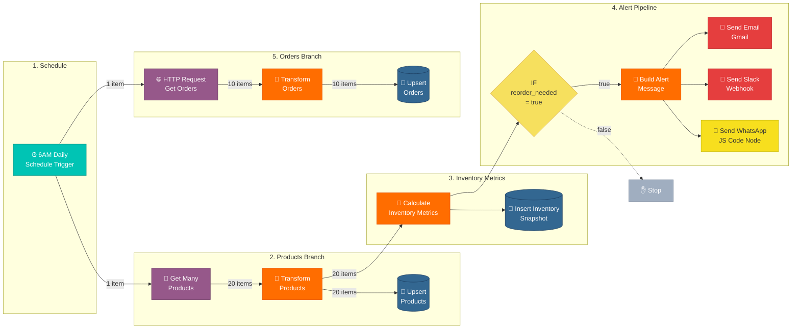

# n8n ETL Workflow - Node Flow Diagram

## Node Configuration Reference

| Node | Type | Script / Key Settings |
|------|------|----------------------|
| 6AM Daily | Schedule Trigger | Every day at 6:00 AM |
| Get Many Products | WooCommerce | Resource: Product, Get All |
| HTTP Request (Get Orders) | HTTP Request | WooCommerce REST API, GET orders |
| Transform Products | Code (Python) | `scripts/n8n_transform_products.py` — Maps WooCommerce product fields to schema |
| Transform Orders | Code (Python) | `scripts/n8n_transform_orders.py` — Maps WooCommerce order fields to schema |
| Upsert Products | PostgreSQL | Table: `dim_products`, On Conflict: `woo_product_id` |
| Upsert Orders | PostgreSQL | Table: `fact_orders`, On Conflict: `woo_order_id` |
| Calculate Inventory Metrics | Code (Python) | `scripts/n8n_calculate_inventory_metrics.py` — Separates products/orders, computes avg_daily_sales from order data |
| Insert Inventory Snapshot | PostgreSQL | `scripts/n8n_insert_inventory_snapshot.sql` — Table: `fact_inventory_snapshots` |
| If Reorder Needed | IF | `{{ $json.reorder_needed }}` equals `true` |
| Build Alert Message | Code (Python) | `scripts/n8n_build_alert_message.py` — Builds HTML email, Slack text, WhatsApp payload |
| Send Email | Gmail | Subject: `{{ $json.email_subject }}`, Body: `{{ $json.email_html }}` |
| Slack Notification | HTTP Request | POST to Slack webhook, Body: `{{ $json.slack_text }}` |
| Send WhatsApp Alert | Code (JavaScript) | `scripts/n8n_send_whatsapp_alert.js` — JS workaround for n8n HTTP Request `json: false` bug |

## Key Split Points

1. **Schedule Trigger** → two parallel branches (products + orders)
2. **Transform Products** → Upsert Products + Calculate Inventory Metrics
3. **Calculate Inventory Metrics** → Insert Inventory Snapshot + IF Node
4. **Build Alert Message** → Send Email + Slack + Send WhatsApp Alert (JS Code Node)
