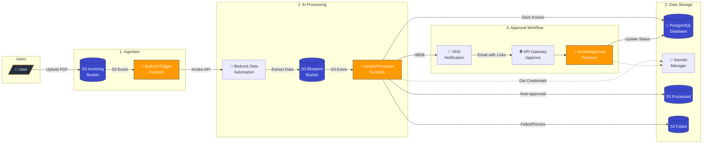

# Invoice Automation System - Architecture Diagram

```mermaid
flowchart LR
    subgraph Users
        U[/"👤 User"/]
    end

    subgraph Ingestion["1. Ingestion"]
        S3In[("S3 Incoming<br/>Bucket")]
        L1["⚡ BedrockTrigger<br/>Function"]
    end

    subgraph Processing["2. AI Processing"]
        Bedrock["🤖 Bedrock Data<br/>Automation"]
        S3BP[("S3 Blueprint<br/>Bucket")]
        L2["⚡ InvoiceProcessor<br/>Function"]
    end

    subgraph Storage["3. Data Storage"]
        RDS[("🐘 PostgreSQL<br/>Database")]
        Secrets["🔐 Secrets<br/>Manager"]
        S3Proc[("S3 Processed")]
        S3Fail[("S3 Failed")]
    end

    subgraph Approval["4. Approval Workflow"]
        SNS["📧 SNS<br/>Notification"]
        API["🌐 API Gateway<br/>/approve"]
        L3["⚡ InvoiceApproval<br/>Function"]
    end

    %% Main Flow
    U -->|"Upload PDF"| S3In
    S3In -->|"S3 Event"| L1
    L1 -->|"Invoke API"| Bedrock
    Bedrock -->|"Extract Data"| S3BP
    S3BP -->|"S3 Event"| L2

    %% Processor connections
    L2 -.->|"Get Credentials"| Secrets
    L2 -->|"Save Invoice"| RDS
    L2 -->|"Auto-approved"| S3Proc
    L2 -->|"Failed/Review"| S3Fail

    %% Approval workflow
    L2 -->|">$50k"| SNS
    SNS -->|"Email with Links"| API
    API --> L3
    L3 -->|"Update Status"| RDS
    L3 -.-> Secrets

    %% Styling
    classDef aws fill:#FF9900,stroke:#232F3E,color:#232F3E
    classDef lambda fill:#FF9900,stroke:#232F3E,color:white
    classDef storage fill:#3B48CC,stroke:#232F3E,color:white
    classDef database fill:#3B48CC,stroke:#1A1A2E,color:white
    classDef user fill:#232F3E,stroke:#FF9900,color:white

    class S3In,S3BP,S3Proc,S3Fail storage
    class L1,L2,L3 lambda
    class RDS database
    class U user
```