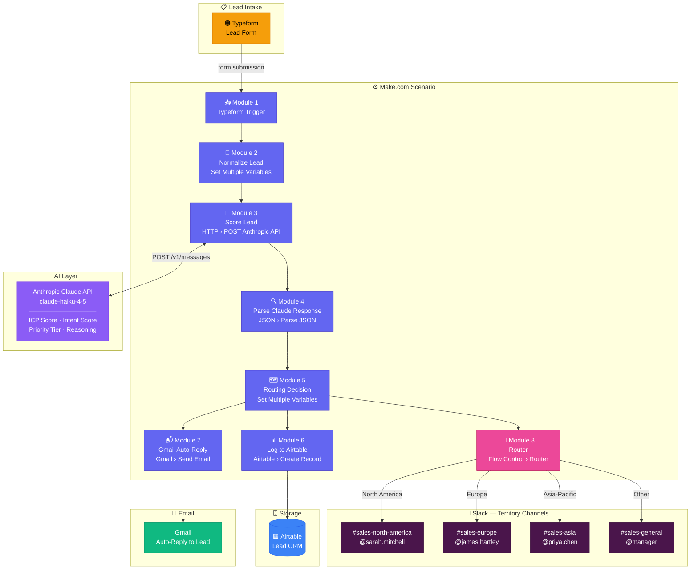

# Architecture — Lead Scoring & Territory Routing

```mermaid
flowchart TD
    subgraph INTAKE ["📋 Lead Intake"]
        TF["🟠 Typeform\nLead Form"]
    end

    subgraph MAKE ["⚙️ Make.com Scenario"]
        M1["📥 Module 1\nTypeform Trigger"]
        M2["🔧 Module 2\nNormalize Lead\nSet Multiple Variables"]
        M3["🤖 Module 3\nScore Lead\nHTTP › POST Anthropic API"]
        M4["🔍 Module 4\nParse Claude Response\nJSON › Parse JSON"]
        M5["🗺️ Module 5\nRouting Decision\nSet Multiple Variables"]
        M6["📊 Module 6\nLog to Airtable\nAirtable › Create Record"]
        M7["📬 Module 7\nGmail Auto-Reply\nGmail › Send Email"]
        M8["🔀 Module 8\nRouter\nFlow Control › Router"]
    end

    subgraph AI ["🤖 AI Layer"]
        CLAUDE["Anthropic Claude API\nclaude-haiku-4-5\n───────────────\nICP Score · Intent Score\nPriority Tier · Reasoning"]
    end

    subgraph SLACK ["💬 Slack — Territory Channels"]
        SNA["#sales-north-america\n@sarah.mitchell"]
        SEU["#sales-europe\n@james.hartley"]
        SAS["#sales-asia\n@priya.chen"]
        SOT["#sales-general\n@manager"]
    end

    subgraph STORAGE ["🗄️ Storage"]
        AT[("🟩 Airtable\nLead CRM")]
    end

    subgraph EMAIL ["📧 Email"]
        GM["Gmail\nAuto-Reply to Lead"]
    end

    TF -->|"form submission"| M1
    M1 --> M2
    M2 --> M3
    M3 <-->|"POST /v1/messages"| CLAUDE
    M3 --> M4
    M4 --> M5
    M5 --> M6
    M5 --> M7
    M5 --> M8
    M6 --> AT
    M7 --> GM
    M8 -->|"North America"| SNA
    M8 -->|"Europe"| SEU
    M8 -->|"Asia-Pacific"| SAS
    M8 -->|"Other"| SOT

    classDef makeModule fill:#6366f1,stroke:#4338ca,color:#fff
    classDef platform   fill:#f59e0b,stroke:#d97706,color:#000
    classDef slackChan  fill:#4a154b,stroke:#3b0f3c,color:#fff
    classDef ai         fill:#8b5cf6,stroke:#7c3aed,color:#fff
    classDef storage    fill:#3b82f6,stroke:#2563eb,color:#fff
    classDef email      fill:#10b981,stroke:#059669,color:#fff
    classDef router     fill:#ec4899,stroke:#be185d,color:#fff

    class M1,M2,M3,M4,M5,M6,M7 makeModule
    class M8 router
    class TF platform
    class SNA,SEU,SAS,SOT slackChan
    class CLAUDE ai
    class AT storage
    class GM email
```
