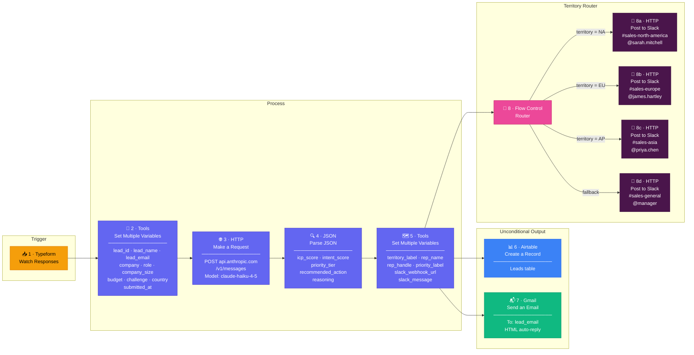

# Make.com Scenario Diagram — Lead Scoring & Territory Routing

## Module Reference

| # | Module | App | Purpose |
|---|--------|-----|---------|
| 1 | Watch Responses | Typeform | Triggers scenario on new form submission |
| 2 | Set Multiple Variables | Tools | Normalises Typeform fields into clean named variables |
| 3 | Make a Request | HTTP | Calls Claude AI ("claude-haiku-4-5") to score the lead |
| 4 | Parse JSON | JSON | Extracts scores and reasoning from Claude's response text |
| 5 | Set Multiple Variables | Tools | Determines territory, rep, and builds Slack message |
| 6 | Create a Record | Airtable | Logs full lead record + AI output to CRM (unconditional) |
| 7 | Send an Email | Gmail | Sends personalised HTML auto-reply to the lead (unconditional) |
| 8 | Router | Flow Control | Splits execution into territory-filtered paths |
| 8a–d | Make a Request | HTTP | Posts Slack message to the correct territory channel |

> **Why Airtable and Gmail come before the Router:** Design principle — every lead is logged and acknowledged regardless of territory. Modules 6 and 7 run unconditionally on every execution. Module 8 (Router) handles only the Slack notification, which is territory-specific.
