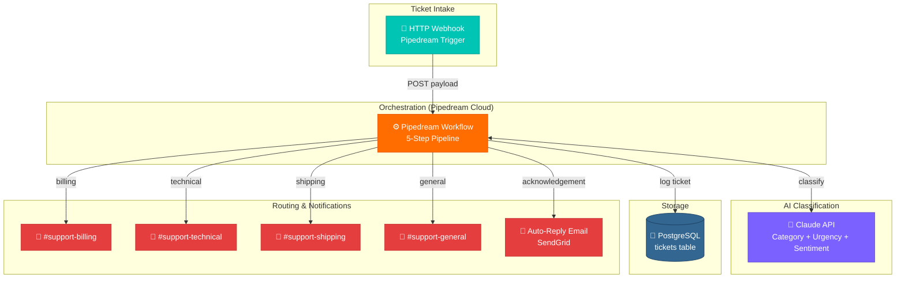

# Support Ticket Automation - High-Level Architecture



## Data Flow Summary

```
HTTP Webhook (ticket payload)
    |
    v
Pipedream Step 1 — Normalize raw payload → structured ticket object
    |
    v
Pipedream Step 2 — Claude API → category, urgency, sentiment, reasoning
    |
    v
Pipedream Step 3 — Build routing decision → channel, SLA hours, reply content
    |
    +---> PostgreSQL  (audit log)
    +---> Slack       (team notification, routed by category)
    +---> SendGrid    (auto-reply to submitter)
```

## Key Design Principles

1. **Stateless steps** — Each Pipedream step receives data from the previous step via `steps.<step_name>.$return_value`. No shared state, no file system access.

2. **Single AI call** — Classification, urgency, and sentiment are all extracted in one Claude API call using a structured JSON output prompt. Minimizes latency and API cost.

3. **Category-driven routing** — The routing decision step maps the AI category to a Slack webhook URL and an SLA target. Adding a new category only requires updating a single lookup dict.

4. **Parallel dispatch** — PostgreSQL log, Slack post, and email reply are independent Pipedream steps that can run in parallel (async step group), keeping end-to-end time under 5 seconds.

5. **Full audit trail** — `ai_reasoning` is stored per ticket so teams can audit why a ticket was classified a certain way without re-calling the API.
```
