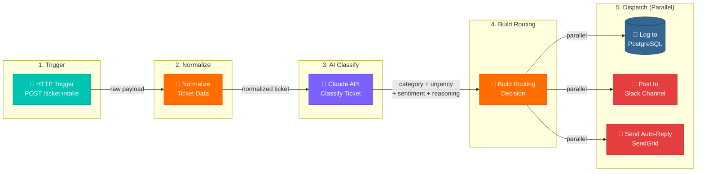

# Pipedream Workflow - Step Flow Diagram



## Step Configuration Reference

| Step | Type | Script / Key Settings |
|------|------|-----------------------|
| HTTP Trigger | Pipedream HTTP trigger | Method: POST, auto-generates webhook URL |
| Normalize Ticket | Code (Python) | `scripts/pd_normalize_ticket.py` — extracts `name`, `email`, `subject`, `body`, generates `ticket_id` |
| Classify Ticket | Code (Python) | `scripts/pd_classify_ticket.py` — calls Claude API, returns structured JSON: `category`, `urgency`, `sentiment`, `sentiment_score`, `reasoning` |
| Build Routing Decision | Code (Python) | `scripts/pd_build_routing_decision.py` — maps category → `slack_webhook_url`, `assigned_channel`, `response_time_hours`; builds Slack message block |
| Log to PostgreSQL | Code (Python) | `scripts/pd_log_to_postgres.py` — inserts full ticket record including AI output to `tickets` table |
| Post to Slack | Code (Python) | `scripts/pd_post_to_slack.py` — HTTP POST to dynamic webhook URL from routing step |
| Send Auto-Reply | Code (Python) | `scripts/pd_build_reply_email.py` — HTML email with `ticket_id`, category, expected response time; sent via SendGrid |

## Step Data Reference

Each step receives the prior step's return value via `steps.<step_name>.$return_value`. No environment variables are read inside scripts — credentials are passed in via Pipedream's environment variable store.

| Step | Input From | Key Output Fields |
|------|-----------|-------------------|
| Normalize | `steps.trigger.event.body` | `ticket_id`, `name`, `email`, `subject`, `body` |
| Classify | Normalize output | `category`, `urgency`, `sentiment`, `sentiment_score`, `reasoning` |
| Build Routing | Normalize + Classify output | `slack_webhook_url`, `assigned_channel`, `response_time_hours`, `slack_payload`, `email_html` |
| Log to PostgreSQL | All prior steps | Writes full row, returns `id` |
| Post to Slack | Build Routing output | HTTP 200 confirmation |
| Send Auto-Reply | Normalize + Build Routing output | SendGrid delivery ID |

## Classification Schema

Claude is prompted to return a strict JSON object:

```json
{
  "category": "billing | technical | shipping | general",
  "urgency": "critical | high | medium | low",
  "sentiment": "positive | neutral | negative",
  "sentiment_score": -1.0,
  "reasoning": "one sentence explanation"
}
```

## SLA Routing Table

| Category | Slack Channel | Response Time Target |
|----------|--------------|----------------------|
| critical (any) | All channels + DM | 1 hour |
| billing | #support-billing | 4 hours |
| technical | #support-technical | 8 hours |
| shipping | #support-shipping | 4 hours |
| general | #support-general | 24 hours |
